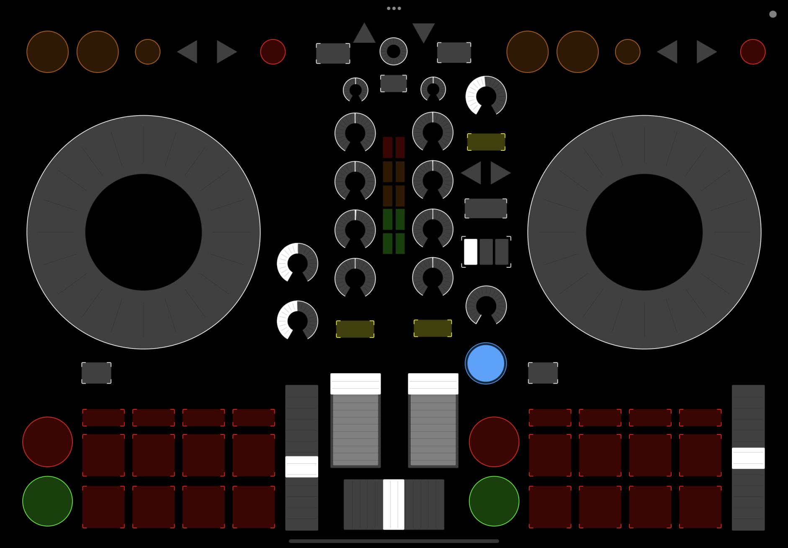

# TouchMixxx fork

- Layout that imitates DDJ-400 
- Support for the latest TouchOSC (non-Mk1)

## Installation

- Copy `TouchOSC/DDJ-400.tosc` to your iPad and import it in TouchOSC
  * Launch TouchOSC Bridge on your computer
  * Connect TouchOSC to TouchOSC Bridge; see https://hexler.net/touchosc/manual/connections-bridge
- Copy the files under `src` into the Mixxx contollers directory; see https://manual.mixxx.org/2.3/en/chapters/appendix/settings_directory.html
  * Open 'Preferences' in Mixxx
  * Enable 'TouchOSC Bridge' under Controllers
  * In the 'Load Preset' dropdown, choose 'TouchMixxx', click 'OK'

## Unimplemented

- Filter knob
- Loop buttons
- Beat FX
